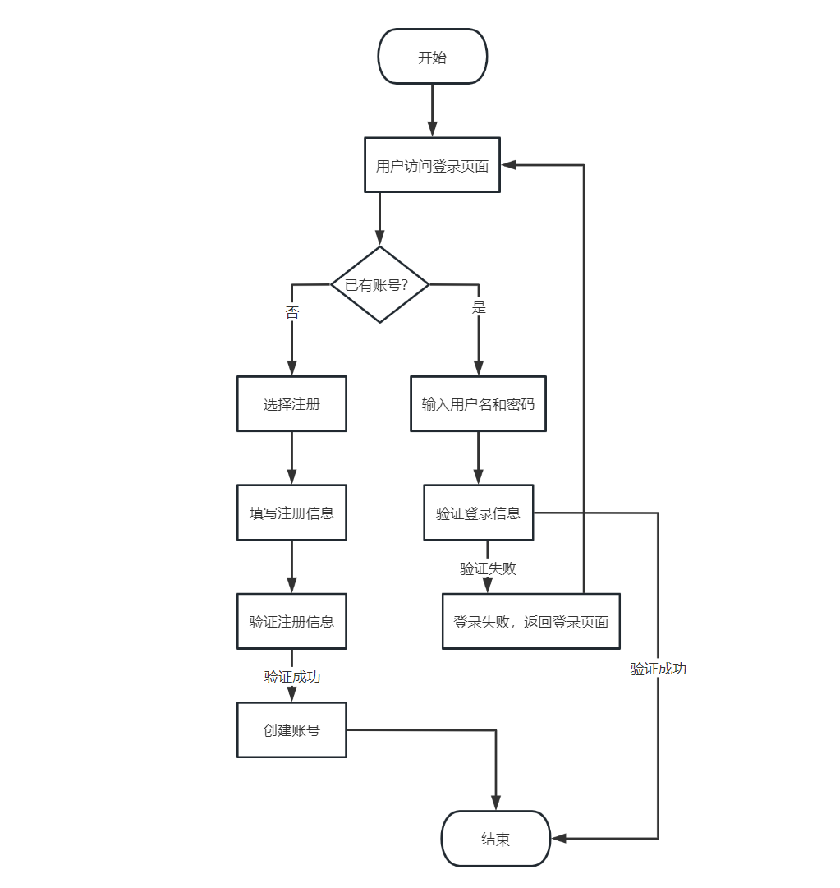
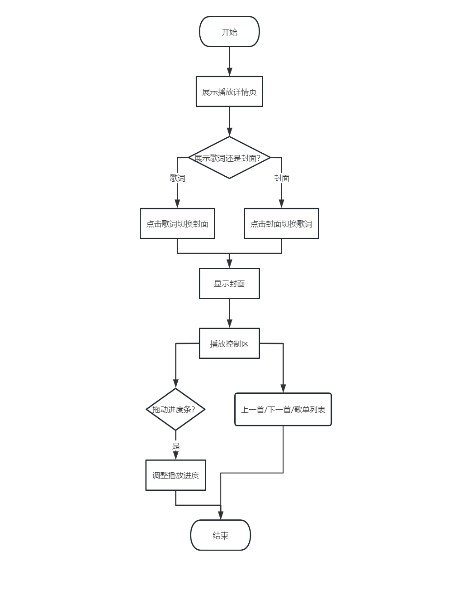
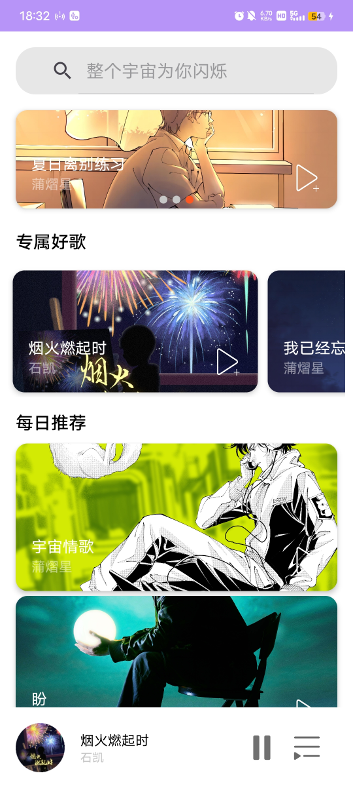
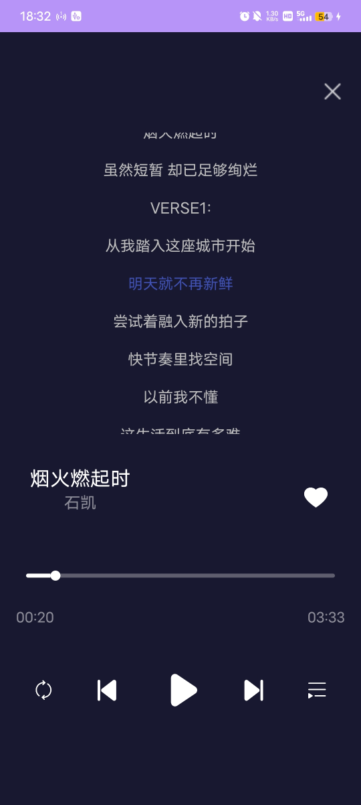
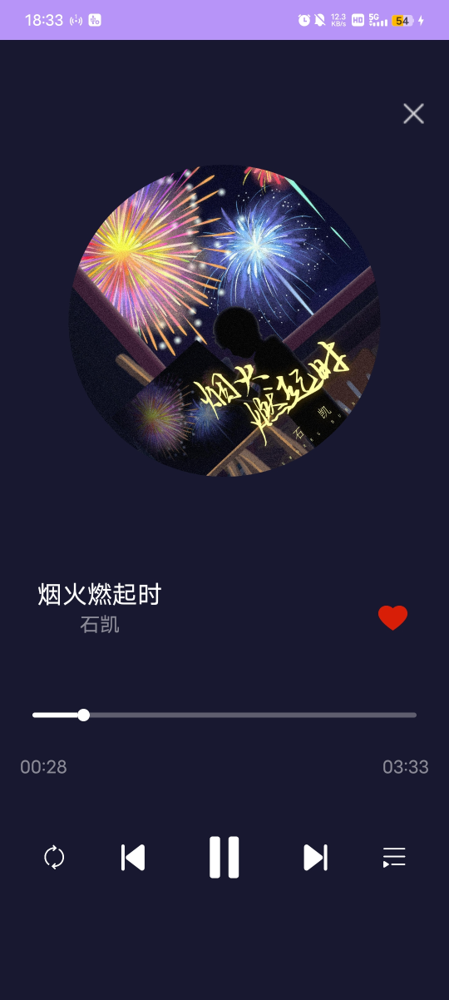
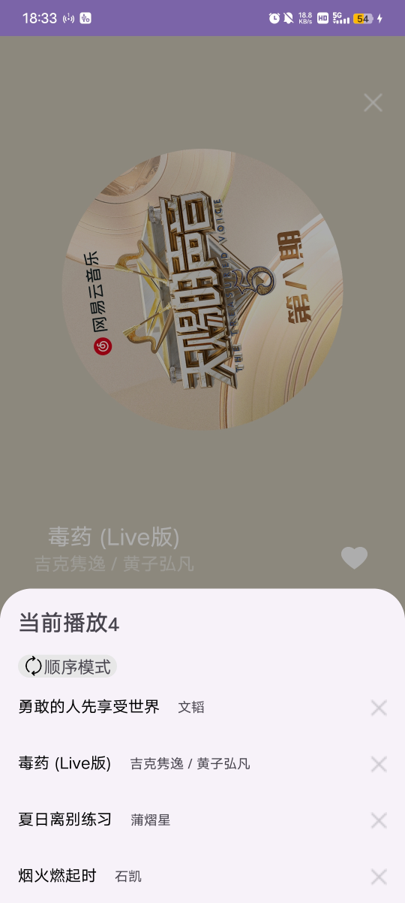

### my-Music-App
本项目为安卓开发实战项目，仅作为学习用，性能和功能有待完善。
在这此个人练习项目中，我构建了一个音乐社区应用，使用Android的
Activity和Fragment实现UI，通过OkHttp和Gson异步获取网络歌曲资源。
我创建了一个MediaPlayer服务，支持后台播放，并利用本地广播实现跨页
面的歌曲状态同步。应用还具备收藏、播放列表管理和悬浮视图功能。通过nodejs
简单搭建一个后端用于处理用户登录和注册的逻辑。使用mysql数据库保存用户的登陆信息。
### 系统模块设计
#### 登录注册模块

#### 首页功能模块

#### 播放详情页模块

### 功能展示
#### 1.登陆注册
注册功能

登录功能

#### 2.app首页
app的首页分为四大板块进行展示，
分别为顶部轮播图、每日推荐、专属好歌、
热门金曲，每个模块都有若干歌曲，通过okhttp异步请求
网络接口获得歌曲数据。每首歌展示歌曲封面和歌曲名称，支持添加歌曲到播放列表，
播放列表通过Singleton的实例对象PlaylistManager进行维护。首页底部具有迷你
悬浮view用于简洁的呈现当前播放的歌曲以及播放控制。

#### 3.播放详情页
播放详情页面仿照主流app的样式，分为歌曲信息区和播放控制区。歌曲信息部分
展示当前播放的歌曲的歌词、封面、作者、歌名。点击歌词将切换为封面，封面使用Glide插件
进行格式化样式，同时添加属性动画使得封面随播放状态顺时针旋转。
- 展示歌词

- 展示封面

播放详情页的背景颜色会随着歌曲封面的主体颜色而改变，这里使用了palette取色组件库。
- 展示歌单列表

歌单是通过BottomSheetDialog里填充RecycleView简单实现的，将recycleView的数据dataList
与LpaylistManager维护的歌曲列表musicInfoList进行绑定，当有数据变更时就对应的刷新页面。
#### 其他功能
1.  音乐社区支持后台播放，有需要通过页面前端操作控制播放的状态，所以service需要通过两种方式启动：StartService和BindService。
退出播放详情页之后在主页的d底部悬浮view需要同步播放状态，这里我使用的解决方案是使用本地广播通知播放状态和当前播放的歌曲的id，以展示正确的歌曲信息。
2. 收藏歌曲，这里仅仅简单模拟了点赞和取消点赞，使用sharedPrefrence将歌曲和点赞状态保存在本地。
3. 播放模式切换。支持顺序播放、随机播放、和单曲循环。通过修改PlayListManager的上一首和下一首的切换逻辑实现。
4. 自动下一首。自动下一首的实现是通过mediaPlayer的状态监听实现，当前歌曲播放结束后调用下一首的罗辑和play功能。
### 总结
此音乐社区app实现了基本的注册登录和相较正常完善的歌曲播放功能。实现了添加到播放列表、暂停、播放、上一首、下一首、歌单列表、进度条、歌词进度条等
音乐播放的基本功能以及较为美观的UI界面。
#### 存在的问题
1.  首页RecycleView显示不完全的问题。模块嵌套过于复杂，显示不完整与layout底层的onMeasure逻辑有关，界面的高度没有被正确的计算u。
2. okhttp异步加载的问题。由于使用异步加载，内容加载的速度没问题，内在较短的时间内得到响应的数据并填充界面。但是偶尔会出现空白块的问题，即界面加载不同步，有的歌曲
加载了，有的歌曲内容还未加载的问题。
3. 歌单进行删除歌曲操作。当歌单删除当前正在播放的歌曲时会导致程序异常。这个容易解决，只需要完善删除歌曲的判断逻辑，当删除正在播放的歌曲时，先调用下一首歌曲功能，再将上一首歌曲删除。
4. 内存泄漏检查，使用了广播和handle，注意在适当的地方进行注销广播和资源释放。

